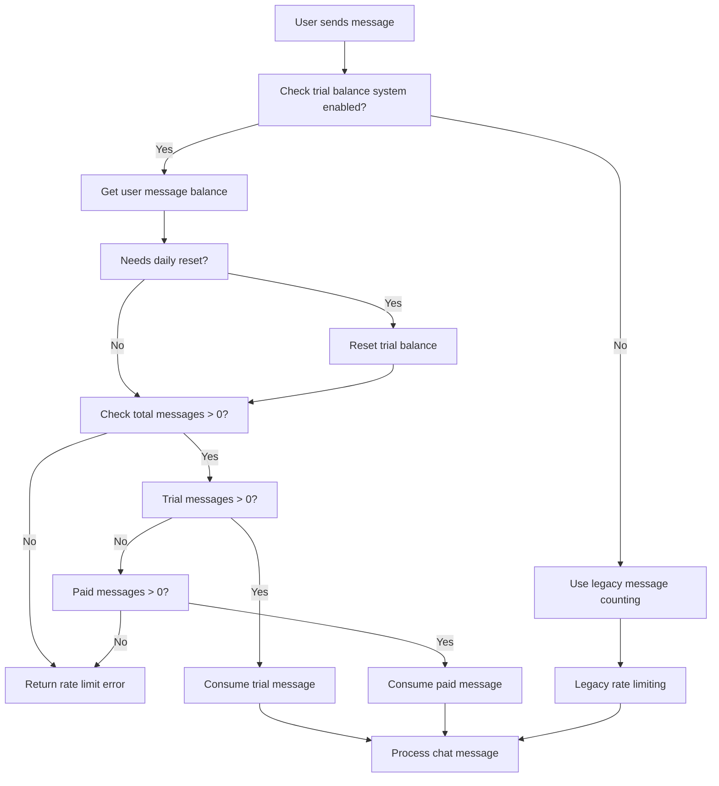

# Trial Balance System Implementation

## 🎯 **Overview**

The Trial Balance System replaces the legacy daily message counting with a more flexible balance-based approach that supports:

- **Daily Trial Messages**: Refreshes every 24 hours
- **Paid Messages**: Purchased with Telegram Stars
- **Automatic Reset**: Trial balance resets daily
- **Priority Consumption**: Trial messages used first, then paid messages

---

## 📊 **User Types & Limits**

| User Type | Trial Messages/Day | Legacy Limit | Payment Support |
|-----------|-------------------|--------------|-----------------|
| **Guest** (unregistered) | 2 messages | 50 messages | ✅ Telegram Stars |
| **Regular** (registered) | 5 messages | 200 messages | ✅ Telegram Stars |

---

## 🏗️ **Database Schema Changes**

### **User Table - New Columns**
```sql
-- Trial balance system
trialMessagesRemaining: INTEGER DEFAULT 0
trialLastResetAt: TIMESTAMP DEFAULT NOW()

-- Paid message balance system  
paidMessagesRemaining: INTEGER DEFAULT 0
totalMessagesPurchased: INTEGER DEFAULT 0
lastPurchaseAt: TIMESTAMP
```

### **New StarPayment Table**
```sql
CREATE TABLE "StarPayment" (
  id: UUID PRIMARY KEY
  userId: UUID REFERENCES User(id)
  telegramPaymentChargeId: VARCHAR(255) UNIQUE
  starAmount: INTEGER
  messagesAdded: INTEGER
  status: VARCHAR(20) DEFAULT 'completed'
  createdAt: TIMESTAMP DEFAULT NOW()
)
```

---

## ⚙️ **Configuration**

### **Entitlements** (`lib/ai/entitlements.ts`)
```typescript
export const entitlementsByUserType = {
  guest: {
    trialMessagesPerDay: 2,    // NEW: 2 trial messages/day
    useTrialBalance: true,     // NEW: Enable trial balance
    maxMessagesPerDay: 50,     // LEGACY: For backward compatibility
  },
  regular: {
    trialMessagesPerDay: 5,    // NEW: 5 trial messages/day
    useTrialBalance: true,     // NEW: Enable trial balance
    maxMessagesPerDay: 200,    // LEGACY: For backward compatibility
  }
};
```

### **Payment Configuration**
```typescript
export const PAYMENT_CONFIG = {
  STARS_PER_MESSAGE: 5,        // 1 message = 5 stars
  MINIMUM_MESSAGES: 20,        // Minimum purchase: 20 messages
  PACKAGES: [
    { messages: 20, stars: 100, popular: false, bonus: 0 },
    { messages: 50, stars: 250, popular: true, bonus: 0 },
    { messages: 100, stars: 500, popular: false, bonus: 5 },
    { messages: 200, stars: 1000, popular: false, bonus: 20 }
  ]
};
```

---

## 🔧 **Core Functions**

### **1. Get User Message Balance**
```typescript
getUserMessageBalance(userId: string): Promise<{
  trialMessagesRemaining: number;
  paidMessagesRemaining: number;
  totalMessagesRemaining: number;
  needsReset: boolean;
}>
```

### **2. Reset Daily Trial Balance**
```typescript
resetDailyTrialBalance(userId: string): Promise<void>
```

### **3. Consume User Message**
```typescript
consumeUserMessage(userId: string): Promise<{
  success: boolean;
  remainingMessages: number;
  usedTrial: boolean;
}>
```

### **4. Add Paid Messages**
```typescript
addPaidMessages(userId: string, messageCount: number): Promise<void>
```

### **5. Record Star Payment**
```typescript
recordStarPayment({
  userId: string;
  telegramPaymentChargeId: string;
  starAmount: number;
  messagesAdded: number;
}): Promise<StarPayment>
```

---

## 🔄 **Message Consumption Flow**



---

## 📈 **API Updates**

### **Chat API** (`app/(chat)/api/chat/route.ts`)
```typescript
// NEW: Use trial balance system
if (entitlements.useTrialBalance) {
  const consumeResult = await consumeUserMessage(session.user.id);
  
  if (!consumeResult.success) {
    return new ChatSDKError('rate_limit:chat').toResponse();
  }
} else {
  // LEGACY: Fall back to old system
  const messageCount = await getMessageCountByUserId({...});
  if (messageCount > entitlements.maxMessagesPerDay) {
    return new ChatSDKError('rate_limit:chat').toResponse();
  }
}
```

### **User Stats API** (`app/api/user/stats/route.ts`)
```typescript
// NEW: Include trial balance information
return NextResponse.json({
  // Legacy fields (backward compatibility)
  messagesLast24h,
  totalMessages,
  joinDate,
  
  // NEW: Trial balance fields
  trialBalance: {
    trialMessagesRemaining: balance.trialMessagesRemaining,
    paidMessagesRemaining: balance.paidMessagesRemaining,
    totalMessagesRemaining: balance.totalMessagesRemaining,
    needsReset: balance.needsReset,
    trialMessagesPerDay: entitlements.trialMessagesPerDay,
    useTrialBalance: entitlements.useTrialBalance,
  }
});
```

---

## 🚀 **Migration Process**

### **1. Database Migration**
```bash
# Run the migration
psql $POSTGRES_URL -f lib/db/migrations/0003_trial_balance_system.sql
```

### **2. Initialize Existing Users**
The migration automatically initializes trial balance for existing users:
- **Guest users**: 2 trial messages
- **Regular users**: 5 trial messages

### **3. Backward Compatibility**
- Legacy `maxMessagesPerDay` still works for systems that don't use trial balance
- `useTrialBalance: false` falls back to old message counting
- All existing APIs remain functional

---

## 🧪 **Testing**

### **Run Logic Tests**
```bash
node scripts/test-trial-balance.js
```

### **Test Coverage**
- ✅ User type detection (guest vs regular)
- ✅ Daily reset logic (24-hour window)
- ✅ Message consumption priority (trial first, then paid)
- ✅ Payment package calculations
- ✅ Edge cases (no messages left, reset timing)

---

## 🔮 **Next Steps: Telegram Stars Integration**

### **Phase 2: Payment System**
1. **Create Telegram Bot Payment API** (`app/api/telegram/payment/`)
2. **Add Invoice Generation** (using Telegram Bot API)
3. **Handle Payment Webhooks** (successful_payment events)
4. **Update User Balance** (add purchased messages)
5. **Create Payment UI** (for web users)

### **Phase 3: Enhanced Features**
1. **Payment History UI**
2. **Usage Analytics Dashboard**
3. **Subscription Plans** (monthly unlimited)
4. **Referral System** (bonus messages)

---

## 📝 **Key Benefits**

### **✅ Advantages Over Legacy System**
1. **Flexible Balance**: Mix of trial + paid messages
2. **Daily Reset**: Automatic trial refresh
3. **Payment Ready**: Built for Telegram Stars integration
4. **Better UX**: Clear balance tracking
5. **Scalable**: Easy to add new user types/limits

### **✅ Backward Compatibility**
1. **Legacy APIs**: Still work unchanged
2. **Gradual Migration**: Can enable per user type
3. **Fallback System**: Automatic fallback to old system
4. **Zero Downtime**: No breaking changes

---

## 🔧 **Configuration Options**

### **Easy Adjustments**
```typescript
// Change trial limits
entitlementsByUserType.guest.trialMessagesPerDay = 3;  // 2 → 3
entitlementsByUserType.regular.trialMessagesPerDay = 10; // 5 → 10

// Change payment rates
PAYMENT_CONFIG.STARS_PER_MESSAGE = 3;  // 5 → 3 stars per message
PAYMENT_CONFIG.MINIMUM_MESSAGES = 10;  // 20 → 10 minimum purchase

// Add new packages
PAYMENT_CONFIG.PACKAGES.push({
  messages: 500, 
  stars: 2000, 
  popular: false, 
  bonus: 100 
});
```

### **Feature Toggles**
```typescript
// Disable trial balance for specific user type
entitlementsByUserType.guest.useTrialBalance = false;

// Enable for new user types
entitlementsByUserType.premium = {
  trialMessagesPerDay: 0,     // No trial needed
  useTrialBalance: true,      // Use balance system
  maxMessagesPerDay: 1000,    // High legacy limit
};
```

---

## 📊 **Monitoring & Analytics**

### **Key Metrics to Track**
1. **Trial Usage**: Daily trial message consumption
2. **Payment Conversion**: Trial → Paid conversion rate
3. **Balance Distribution**: Trial vs paid message usage
4. **Reset Patterns**: When users hit daily limits
5. **Package Popularity**: Which payment packages sell best

### **Database Queries for Analytics**
```sql
-- Daily trial resets
SELECT COUNT(*) FROM "User" 
WHERE "trialLastResetAt" > NOW() - INTERVAL '1 day';

-- Payment conversion rate
SELECT 
  COUNT(DISTINCT "userId") as paid_users,
  (SELECT COUNT(*) FROM "User") as total_users,
  ROUND(COUNT(DISTINCT "userId") * 100.0 / (SELECT COUNT(*) FROM "User"), 2) as conversion_rate
FROM "StarPayment";

-- Popular payment packages
SELECT "starAmount", "messagesAdded", COUNT(*) as purchases
FROM "StarPayment" 
GROUP BY "starAmount", "messagesAdded" 
ORDER BY purchases DESC;
```

---

This trial balance system provides a solid foundation for monetization while maintaining excellent user experience and backward compatibility! 🚀 