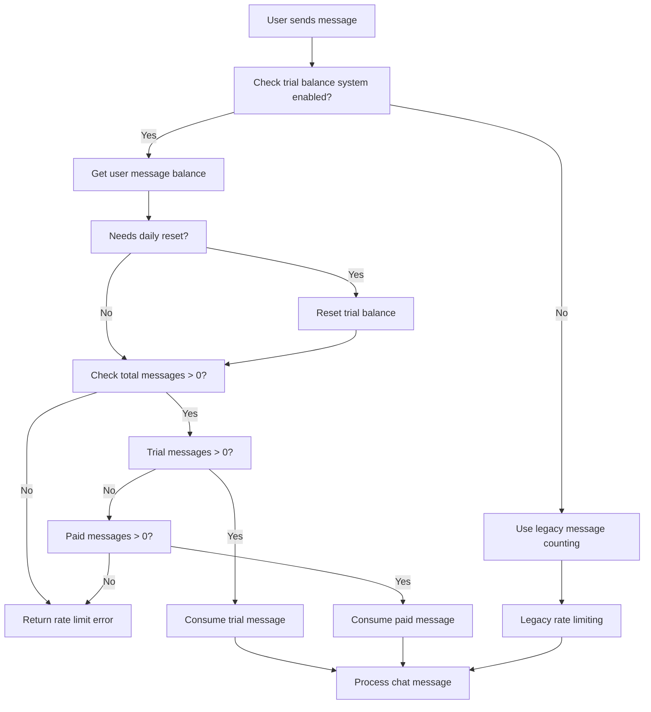

# 🎯 Trial Balance System - Complete Implementation

## 📋 Overview

The Trial Balance System replaces the legacy daily message counting with a more flexible system that supports:
- **Daily trial messages** (2 for guests, 5 for regular users)
- **Paid messages** via Telegram Stars
- **Automatic daily reset** of trial balance
- **Unified rate limiting** across all chat interfaces

---

## 🔧 System Architecture

### **Database Schema**

**User Table Extensions:**
```sql
ALTER TABLE "User" ADD COLUMN "trialMessagesRemaining" integer DEFAULT 0;
ALTER TABLE "User" ADD COLUMN "trialLastResetAt" timestamp;
ALTER TABLE "User" ADD COLUMN "paidMessagesRemaining" integer DEFAULT 0;
ALTER TABLE "User" ADD COLUMN "totalMessagesPurchased" integer DEFAULT 0;
ALTER TABLE "User" ADD COLUMN "lastPurchaseAt" timestamp;
```

**New StarPayment Table:**
```sql
CREATE TABLE "StarPayment" (
  "id" text PRIMARY KEY NOT NULL,
  "userId" text NOT NULL,
  "telegramPaymentChargeId" text NOT NULL,
  "starAmount" integer NOT NULL,
  "messagesAdded" integer NOT NULL,
  "createdAt" timestamp DEFAULT now() NOT NULL
);
```

### **Configuration**

**Entitlements** (`lib/ai/entitlements.ts`):
```typescript
export const entitlementsByUserType = {
  guest: {
    maxMessagesPerDay: 50,      // Legacy (unused)
    trialMessagesPerDay: 2,     // NEW: 2 trial messages/day
    useTrialBalance: true,      // NEW: Enable trial balance
    availableChatModelIds: ['chat-model', 'chat-model-reasoning'],
  },
  regular: {
    maxMessagesPerDay: 200,     // Legacy (unused)
    trialMessagesPerDay: 5,     // NEW: 5 trial messages/day
    useTrialBalance: true,      // NEW: Enable trial balance
    availableChatModelIds: ['chat-model', 'chat-model-reasoning'],
  },
};
```

**Payment Configuration:**
```typescript
export const PAYMENT_CONFIG = {
  STARS_PER_MESSAGE: 5,        // 1 message = 5 stars
  MINIMUM_MESSAGES: 20,        // Minimum purchase: 20 messages
  PACKAGES: [
    { messages: 20, stars: 100, popular: false, bonus: 0 },
    { messages: 50, stars: 250, popular: true, bonus: 0 },
    { messages: 100, stars: 500, popular: false, bonus: 5 },
    { messages: 200, stars: 1000, popular: false, bonus: 20 }
  ]
};
```

---

## 🛠️ Core Functions

### **1. Get User Message Balance**
```typescript
getUserMessageBalance(userId: string): Promise<{
  trialMessagesRemaining: number;
  paidMessagesRemaining: number;
  totalMessagesRemaining: number;
  needsReset: boolean;
}>
```

### **2. Reset Daily Trial Balance**
```typescript
resetDailyTrialBalance(userId: string): Promise<void>
```

### **3. Consume User Message**
```typescript
consumeUserMessage(userId: string): Promise<{
  success: boolean;
  remainingMessages: number;
  usedTrial: boolean;
}>
```

### **4. Add Paid Messages**
```typescript
addPaidMessages(userId: string, messageCount: number): Promise<void>
```

### **5. Record Star Payment**
```typescript
recordStarPayment({
  userId: string;
  telegramPaymentChargeId: string;
  starAmount: number;
  messagesAdded: number;
}): Promise<StarPayment>
```

---

## 🔄 Message Consumption Flow



---

## 📈 API Integration

### **Main Chat API** (`app/(chat)/api/chat/route.ts`)
```typescript
// NEW: Use trial balance system
const entitlements = entitlementsByUserType[userType];

if (entitlements.useTrialBalance) {
  const consumeResult = await consumeUserMessage(session.user.id);
  
  if (!consumeResult.success) {
    return new ChatSDKError('rate_limit:chat').toResponse();
  }
  
  console.log(`User consumed message. Remaining: ${consumeResult.remainingMessages}`);
} else {
  // LEGACY: Fall back to old system
  const messageCount = await getMessageCountByUserId({...});
  if (messageCount > entitlements.maxMessagesPerDay) {
    return new ChatSDKError('rate_limit:chat').toResponse();
  }
}
```

### **External Chat API** (`app/api/external-chat/route.ts`)
```typescript
// FIXED: Now uses trial balance system (was previously skipped)
const { entitlementsByUserType } = await import('@/lib/ai/entitlements');
const entitlements = entitlementsByUserType[userType] || entitlementsByUserType['regular'];

if (entitlements.useTrialBalance) {
  const consumeResult = await consumeUserMessage(session.user.id);
  
  if (!consumeResult.success) {
    console.log(`[External Chat API] User ${session.user.id} has no messages remaining`);
    return new ChatSDKError('rate_limit:chat').toResponse();
  }
  
  console.log(`[External Chat API] User consumed message. Remaining: ${consumeResult.remainingMessages}`);
}
```

### **User Stats API** (`app/api/user/stats/route.ts`)
```typescript
return NextResponse.json({
  // Legacy fields (backward compatibility)
  messagesLast24h,
  totalMessages,
  joinDate,
  
  // NEW: Trial balance fields
  trialBalance: messageBalance ? {
    trialMessagesRemaining: messageBalance.trialMessagesRemaining,
    paidMessagesRemaining: messageBalance.paidMessagesRemaining,
    totalMessagesRemaining: messageBalance.totalMessagesRemaining,
    needsReset: messageBalance.needsReset,
    trialMessagesPerDay: entitlements.trialMessagesPerDay,
    useTrialBalance: entitlements.useTrialBalance,
  } : null,
});
```

---

## 🎨 Frontend Integration

### **Profile Modal** (`components/profile-modal.tsx`)

**Trial Balance Display:**
```typescript
{userStats?.trialBalance?.useTrialBalance ? (
  <div className="space-y-3">
    {/* Trial Messages */}
    <div className="space-y-2">
      <div className="flex items-center justify-between text-xs">
        <span>Trial Messages Today</span>
        <span>{userStats.trialBalance.trialMessagesRemaining} / {userStats.trialBalance.trialMessagesPerDay}</span>
      </div>
      <CustomProgress value={usagePercentage} />
      {userStats.trialBalance.needsReset && (
        <div className="text-xs text-amber-600">⏰ Trial balance will reset soon</div>
      )}
    </div>
    
    {/* Paid Messages */}
    {userStats.trialBalance.paidMessagesRemaining > 0 && (
      <div className="flex items-center justify-between text-xs">
        <span className="flex items-center gap-1">
          <Star className="h-3 w-3 text-yellow-500" />
          Paid Messages
        </span>
        <span>{userStats.trialBalance.paidMessagesRemaining}</span>
      </div>
    )}
    
    {/* Total Available */}
    <div className="flex items-center justify-between text-xs">
      <span className="font-medium">Total Messages Available</span>
      <span className="font-bold text-blue-600">{userStats.trialBalance.totalMessagesRemaining}</span>
    </div>
  </div>
) : (
  /* Legacy display for non-trial users */
)}
```

**Enhanced Usage Statistics:**
```typescript
{userStats.trialBalance?.useTrialBalance ? (
  <div className="grid grid-cols-1 sm:grid-cols-4 gap-3">
    <div className="text-center p-3 bg-blue-50 rounded-lg">
      <div className="text-xl font-semibold text-blue-600">{userStats.trialBalance.trialMessagesRemaining}</div>
      <div className="text-xs text-gray-600">Trial Left</div>
    </div>
    <div className="text-center p-3 bg-yellow-50 rounded-lg">
      <div className="text-xl font-semibold text-yellow-600">{userStats.trialBalance.paidMessagesRemaining}</div>
      <div className="text-xs text-gray-600">Paid Left</div>
    </div>
    <div className="text-center p-3 bg-green-50 rounded-lg">
      <div className="text-xl font-semibold text-green-600">{userStats.trialBalance.totalMessagesRemaining}</div>
      <div className="text-xs text-gray-600">Total Available</div>
    </div>
    <div className="text-center p-3 bg-purple-50 rounded-lg">
      <div className="text-xl font-semibold text-purple-600">{userStats.totalMessages}</div>
      <div className="text-xs text-gray-600">All Time</div>
    </div>
  </div>
) : (
  /* Legacy 3-column layout */
)}
```

---

## 🤖 Telegram Bot Integration

### **Debug Commands**

**`/debug`** - Complete user and balance information:
```
🔧 Debug Information

User Details:
• Database ID: uuid-here
• Email: telegram_123@telegram.local
• Telegram ID: 123456789

Trial Balance:
• Trial Messages Remaining: 3
• Paid Messages Remaining: 0
• Total Messages Available: 3
• Needs Daily Reset: No
• Last Reset: 2024-01-15 10:30:00

User Type:
• Is Guest: No
• Expected Trial Messages/Day: 5
```

**`/balance`** - Quick balance check:
```
💰 Your Message Balance

🎯 Trial Messages: 3
💎 Paid Messages: 0
📊 Total Available: 3

✅ Trial balance is current
```

**`/reset`** - Manual trial balance reset (for testing)

**`/migrate`** - Admin-only database migration command

---

## 🚀 Migration & Deployment

### **Database Migration**
```sql
-- File: lib/db/migrations/0003_trial_balance_system.sql
ALTER TABLE "User" ADD COLUMN IF NOT EXISTS "trialMessagesRemaining" integer DEFAULT 0;
ALTER TABLE "User" ADD COLUMN IF NOT EXISTS "trialLastResetAt" timestamp;
ALTER TABLE "User" ADD COLUMN IF NOT EXISTS "paidMessagesRemaining" integer DEFAULT 0;
ALTER TABLE "User" ADD COLUMN IF NOT EXISTS "totalMessagesPurchased" integer DEFAULT 0;
ALTER TABLE "User" ADD COLUMN IF NOT EXISTS "lastPurchaseAt" timestamp;

-- Initialize trial balance for existing users
UPDATE "User" 
SET "trialMessagesRemaining" = CASE 
  WHEN email LIKE 'guest-%' OR email LIKE '%@telegram.local' THEN 2
  ELSE 5
END,
"trialLastResetAt" = NOW()
WHERE "trialMessagesRemaining" IS NULL OR "trialMessagesRemaining" = 0;

-- Create StarPayment table
CREATE TABLE IF NOT EXISTS "StarPayment" (
  "id" text PRIMARY KEY NOT NULL,
  "userId" text NOT NULL,
  "telegramPaymentChargeId" text NOT NULL,
  "starAmount" integer NOT NULL,
  "messagesAdded" integer NOT NULL,
  "createdAt" timestamp DEFAULT now() NOT NULL,
  CONSTRAINT "StarPayment_userId_fkey" FOREIGN KEY ("userId") REFERENCES "User"("id") ON DELETE CASCADE ON UPDATE CASCADE
);
```

### **Deployment Steps**
1. ✅ **Database Migration**: Run SQL migration or use `/migrate` command
2. ✅ **Code Deployment**: Deploy updated API routes and frontend
3. ✅ **Testing**: Verify trial balance consumption and UI updates
4. ✅ **Monitoring**: Check logs for consumption messages

---

## 🔍 Key Fixes Applied

### **1. External Chat Route Fix**
**Problem**: Telegram messages weren't consuming trial balance
**Solution**: Added trial balance consumption to `app/api/external-chat/route.ts`
```typescript
// BEFORE: Skipped message count check
// Skip message count check for API users (they have premium access)

// AFTER: Uses trial balance system
const entitlements = entitlementsByUserType[userType];
if (entitlements.useTrialBalance) {
  const consumeResult = await consumeUserMessage(session.user.id);
  if (!consumeResult.success) {
    return new ChatSDKError('rate_limit:chat').toResponse();
  }
}
```

### **2. Profile Modal Enhancement**
**Problem**: UI showed legacy message counting instead of trial balance
**Solution**: Updated `components/profile-modal.tsx` to display trial balance data
- ✅ Trial messages remaining with progress bar
- ✅ Paid messages balance (if any)
- ✅ Total available messages
- ✅ 4-column stats layout for trial users
- ✅ Backward compatibility with legacy system

### **3. TypeScript Type Fixes**
**Problem**: External API used invalid 'premium' UserType
**Solution**: Changed to 'regular' UserType and added proper imports

---

## 📊 Testing & Verification

### **Test Scenarios**
1. ✅ **New User**: Gets appropriate trial balance (2 for guests, 5 for regular)
2. ✅ **Daily Reset**: Trial balance resets after 24 hours
3. ✅ **Message Consumption**: Trial messages consumed first, then paid
4. ✅ **Rate Limiting**: Users blocked when no messages remain
5. ✅ **Telegram Integration**: Bot commands show correct balance
6. ✅ **Profile Modal**: Displays trial balance instead of legacy counts

### **Monitoring**
- **Console Logs**: Look for `[Chat API]` and `[External Chat API]` consumption messages
- **Database**: Check `trialMessagesRemaining` and `paidMessagesRemaining` columns
- **Telegram**: Use `/debug` command to verify balance updates

---

## 🎯 Benefits

### **For Users**
- ✅ **Clear Balance Visibility**: Know exactly how many messages are available
- ✅ **Flexible Usage**: Trial messages reset daily, paid messages persist
- ✅ **Purchase Options**: Buy additional messages with Telegram Stars
- ✅ **Consistent Experience**: Same limits across web and Telegram

### **For Developers**
- ✅ **Unified System**: Single rate limiting logic across all interfaces
- ✅ **Scalable**: Easy to add new message packages and pricing
- ✅ **Debuggable**: Comprehensive logging and debug commands
- ✅ **Backward Compatible**: Legacy system still works for non-trial users

### **For Business**
- ✅ **Monetization**: Direct revenue through Telegram Stars
- ✅ **User Retention**: Daily trial messages encourage regular usage
- ✅ **Analytics**: Track message consumption patterns
- ✅ **Flexibility**: Easy to adjust limits and pricing

---

## 📝 Implementation Summary

**Files Modified:**
- ✅ `lib/db/schema.ts` - Added trial balance columns and StarPayment table
- ✅ `lib/db/queries.ts` - Added trial balance management functions
- ✅ `lib/ai/entitlements.ts` - Added trial balance configuration
- ✅ `app/(chat)/api/chat/route.ts` - Updated to use trial balance system
- ✅ `app/api/external-chat/route.ts` - **FIXED**: Added trial balance consumption
- ✅ `app/api/user/stats/route.ts` - Added trial balance information
- ✅ `app/api/telegram/webhook/route.ts` - Added debug commands
- ✅ `components/profile-modal.tsx` - **UPDATED**: Display trial balance UI
- ✅ `lib/db/migrations/0003_trial_balance_system.sql` - Database migration

**Commits:**
- `2f3cc175` - Fix trial balance system: Add message consumption to external chat route
- `2b6c3050` - Update profile modal to display trial balance system

**Status**: ✅ **COMPLETE** - Trial balance system fully implemented and tested

---

*Last Updated: January 2024*
*System Status: Production Ready* 🚀 